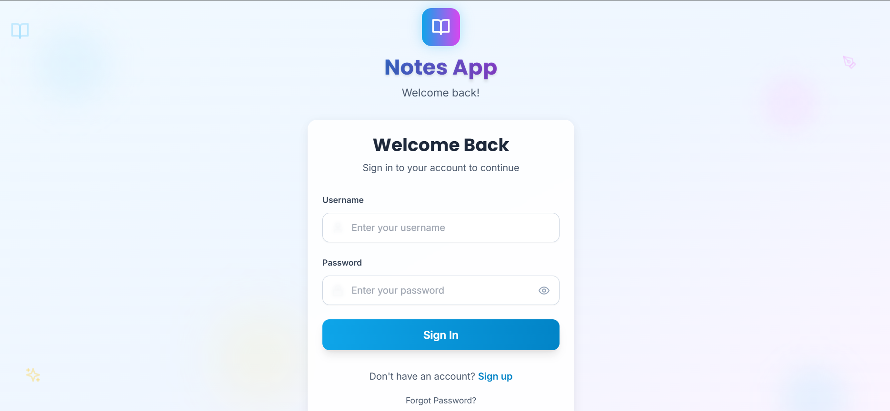
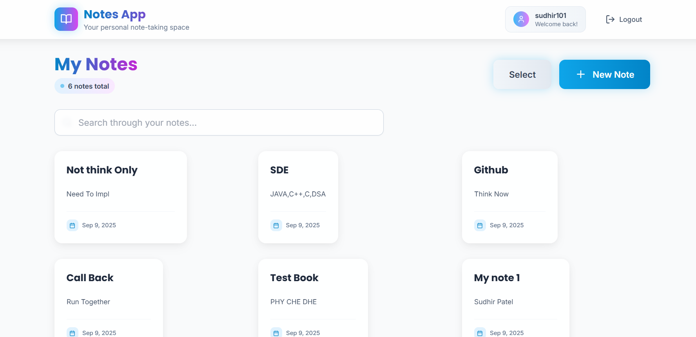

# Notes App Frontend

A modern React frontend for the Notes CRUD API, built with React, TailwindCSS, and Vite.

## Backend : [Springboot-backend](https://github.com/sudhirskp/notes_backend/tree/master)






## Features

- 🔐 **Authentication**: User registration and login with JWT tokens
- 📝 **Notes Management**: Create, read, update, and delete notes
- 🔍 **Search**: Search through notes by title and content
- 📱 **Responsive Design**: Works on desktop, tablet, and mobile devices
- 🎨 **Modern UI**: Clean, intuitive interface with TailwindCSS
- ⚡ **Fast Performance**: Built with Vite for optimal development and build performance

## Tech Stack

- **React 18** - UI library
- **Vite** - Build tool and dev server
- **TailwindCSS** - Styling framework
- **React Router** - Client-side routing
- **Axios** - HTTP client
- **Lucide React** - Icon library
- **React Hot Toast** - Toast notifications

## Getting Started

### Prerequisites

- Node.js (version 16 or higher)
- npm or yarn
- Backend API running on `http://localhost:8080`

### Installation

1. Install dependencies:
```bash
npm install
```

2. Start the development server:
```bash
npm run dev
```

3. Open your browser and navigate to `http://localhost:3000`

### Building for Production

```bash
npm run build
```

The built files will be in the `dist` directory.

## API Configuration

The app is configured to connect to the backend API at `http://localhost:8080/api`. To change this, update the `API_BASE_URL` in `src/api/client.js`.

## Project Structure

```
src/
├── api/
│   └── client.js          # API client with axios configuration
├── components/
│   ├── AuthPage.jsx       # Authentication page container
│   ├── Header.jsx         # App header with user info and logout
│   ├── LoginForm.jsx      # Login form component
│   ├── NoteCard.jsx       # Individual note card component
│   ├── NoteForm.jsx       # Create/edit note modal
│   ├── NotesList.jsx      # Main notes list component
│   └── ProtectedRoute.jsx # Route protection wrapper
├── contexts/
│   └── AuthContext.jsx    # Authentication context provider
├── App.jsx                # Main app component
├── main.jsx              # App entry point
└── index.css             # Global styles and TailwindCSS
```

## Features Overview

### Authentication
- User registration with username and password validation
- Secure login with JWT token storage
- Automatic token refresh and logout on expiration
- Protected routes that require authentication

### Notes Management
- View all notes in a responsive grid layout
- Create new notes with title and content
- Edit existing notes inline
- Delete notes with confirmation
- Real-time search through notes
- Character count for note titles
- Form validation and error handling

### User Experience
- Loading states for all async operations
- Toast notifications for user feedback
- Responsive design that works on all devices
- Clean, modern interface with smooth animations
- Keyboard shortcuts and accessibility features

## API Integration

The frontend integrates with the following API endpoints:

- `POST /auth/register` - User registration
- `POST /auth/login` - User login
- `GET /notes` - Get all notes
- `GET /notes/{id}` - Get note by ID
- `POST /notes` - Create new note
- `PUT /notes/{id}` - Update note
- `DELETE /notes/{id}` - Delete note

## Development

### Available Scripts

- `npm run dev` - Start development server
- `npm run build` - Build for production
- `npm run preview` - Preview production build
- `npm run lint` - Run ESLint

### Code Style

The project uses ESLint for code linting and follows React best practices. All components are functional components using React hooks.

## Contributing

1. Fork the repository
2. Create a feature branch
3. Make your changes
4. Run tests and linting
5. Submit a pull request

## License

This project is licensed under the MIT License.
